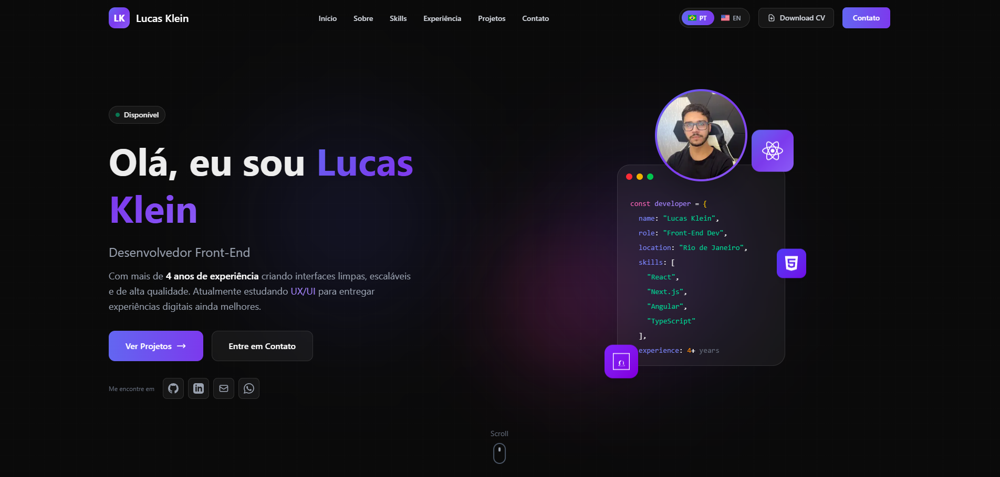

# 💼 Portfolio - Lucas Klein



<div align="center">


### 🚀 Modern & Responsive Portfolio Website

*Desenvolvedor Front-End | React, Next.js, Angular & TypeScript*

[🌐 Ver Demo](https://github.com/olucasklein/portfolio) • [📧 Contato](mailto:olucasklein@hotmail.com) • [💼 LinkedIn](https://www.linkedin.com/in/olucasklein/)

</div>

---

## 📋 Sobre o Projeto

Portfolio pessoal desenvolvido com as mais modernas tecnologias do ecossistema React/Next.js, apresentando minha trajetória profissional, habilidades técnicas, projetos realizados e experiência como Desenvolvedor Front-End.

O site foi projetado com foco em **performance**, **responsividade** e **experiência do usuário**, incorporando animações suaves, efeitos glassmorphism e um design system consistente.

## ✨ Features

- 🎨 **Design Moderno**: Interface dark com efeitos glassmorphism e gradientes vibrantes
- 📱 **Totalmente Responsivo**: Otimizado para desktop, tablet e mobile
- ⚡ **Performance**: Otimização com Next.js 16 e Turbopack
- 🎭 **Animações Suaves**: Transições e efeitos customizados em CSS
- 🔍 **SEO Otimizado**: Meta tags e Open Graph configurados
- 🎯 **Acessibilidade**: Código semântico e navegação intuitiva
- 📬 **Formulário de Contato**: Integração com Resend para envio de emails
- 🌍 **i18n**: Suporte multilíngue (PT-BR e English)
- 🤖 **SEO**: Meta tags, Open Graph, robots.txt e sitemap dinâmico
- 🔧 **PWA Ready**: Manifest e theme colors configurados

## 🛠️ Tecnologias Utilizadas

### Core
- **Next.js 16.1.3** - Framework React com App Router e Turbopack
- **React 19** - Biblioteca para interfaces de usuário
- **TypeScript 5** - Superset JavaScript com tipagem estática
- **Tailwind CSS 3** - Framework CSS utility-first

### Ferramentas & Configs
- **ESLint** - Linting e code quality
- **PostCSS** - Processamento CSS
- **CSS Animations** - Animações customizadas (gradient, float, pulse-glow)
- **Next/Image** - Otimização automática de imagens
- **Resend** - Envio de emails via API
- **Country Flag Icons** - Ícones de bandeiras para seletor de idiomas

## 📂 Estrutura do Projeto

```
portfolio/
├── public/
│   ├── favicon.svg          # Favicon customizado com gradiente LK
│   ├── manifest.json        # PWA manifest
│   ├── robots.txt           # Configuração para SEO
│   └── perfil.jpg           # Foto de perfil
├── src/
│   ├── app/
│   │   ├── api/
│   │   │   └── contact/
│   │   │       └── route.ts # Rota para envio de emails com Resend
│   │   ├── globals.css      # Estilos globais e animações
│   │   ├── layout.tsx       # Layout raiz com metadata e SEO
│   │   ├── sitemap.ts       # Sitemap dinâmico para SEO
│   │   ├── icon.svg         # Favicon automático
│   │   └── page.tsx         # Página principal
│   ├── components/
│   │   ├── Header.tsx       # Navegação fixa com switch de idiomas
│   │   ├── Hero.tsx         # Seção hero com animações
│   │   ├── About.tsx        # Sobre mim com estatísticas
│   │   ├── Skills.tsx       # Habilidades técnicas
│   │   ├── Experience.tsx   # Timeline de experiência
│   │   ├── Projects.tsx     # Projetos em destaque
│   │   ├── Contact.tsx      # Formulário de contato com Resend
│   │   ├── Footer.tsx       # Rodapé com links
│   │   └── index.ts         # Barrel exports
│   └── contexts/
│       └── LanguageContext.tsx # Context para i18n multilíngue
├── tailwind.config.ts       # Configuração Tailwind
├── tsconfig.json            # Configuração TypeScript
├── eslint.config.mjs        # Configuração ESLint
└── package.json             # Dependências e scripts
```

## 🎨 Design System

### Cores Principais
- **Gradientes**: Indigo (#6366f1) → Cyan (#06b6d4) → Pink (#ec4899)
- **Background**: Dark (#0a0a0a)
- **Glass Effect**: backdrop-blur com baixa opacidade

### Animações Customizadas
- `gradient` - Animação de fundo gradiente
- `float` - Efeito de flutuação suave
- `pulse-glow` - Pulso brilhante
- `slide-up` - Entrada de elementos
- `marquee` - Scroll infinito de skills

## 👨‍💻 Sobre Mim

**Lucas Klein** - Desenvolvedor Front-End Júnior

- 📍 Rio de Janeiro, Brasil
- 💼 Tuna Pagamentos - Desenvolvedor Front-End (Ago 2024 - Atual)
- 🎓 Sistemas de Informação + UX/UI Design
- 💪 4+ anos de experiência em desenvolvimento front-end
- 🚀 Especializado em React, Next.js, Angular e TypeScript

### Principais Skills
- React.js, Next.js, Angular
- TypeScript, JavaScript (ES6+)
- Tailwind CSS, Material UI, Styled Components
- Node.js, Express.js
- Git, GitHub, Azure DevOps
- RESTful APIs, GraphQL

## 📫 Contato

<div align="center">

[](https://www.linkedin.com/in/olucasklein/)
[](https://github.com/olucasklein)
[](mailto:olucasklein@hotmail.com)
[](https://wa.me/5522999165664)

</div>

## 📝 Licença

Este projeto está sob a licença MIT. Veja o arquivo [LICENSE](LICENSE) para mais detalhes.

---

<div align="center">

**Desenvolvido com 💙 por Lucas Klein**

⭐ Se gostou do projeto, deixe uma estrela!

</div>
